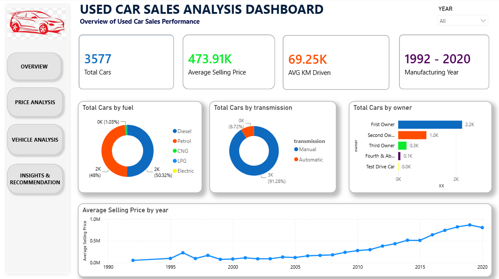
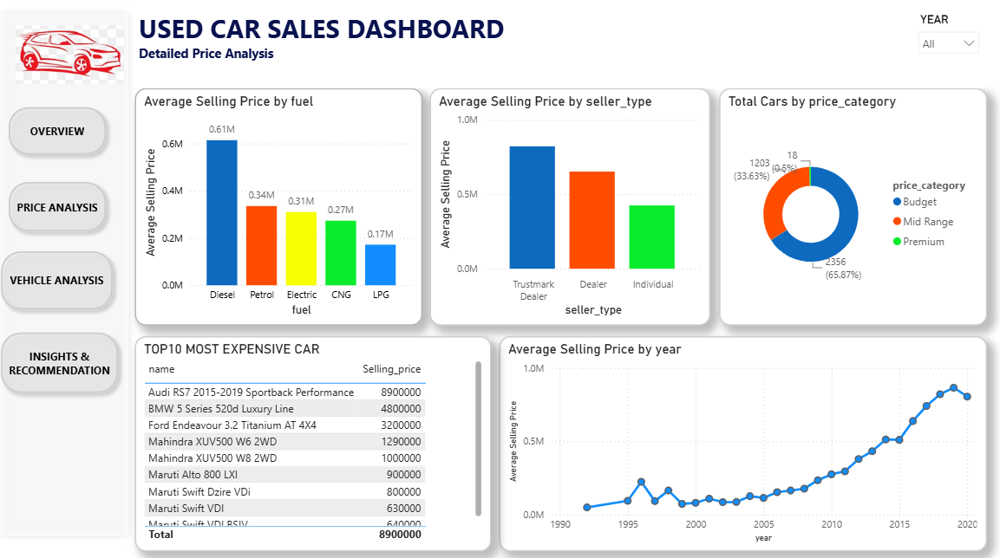
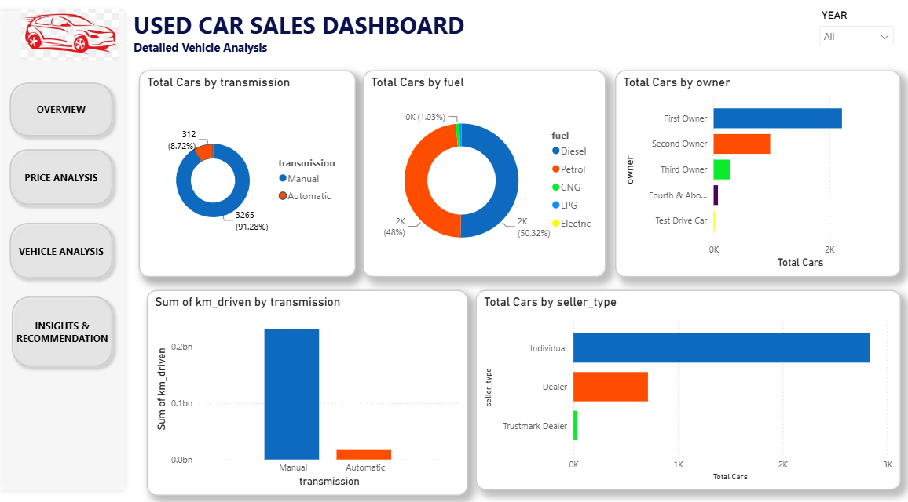

# used-car-sales-analysis
End-to-end data analysis project using **Excel, SQL, PostgreSQL, and Power BI** to analyze used car sales trends, pricing patterns, and business insights.
## Tools Used
- Excel
- SQL
- PostgreSQL
- Power BI
## Project Workflow
- Data cleaning and preprocessing in Excel
- SQL analysis using PostgreSQL
- Exploratory Data Analysis (EDA)
- Interactive dashboard creation in Power BI
- Business insights and recommendations
## Key KPIs
- Total Cars Listed
- Average Selling Price
- Average KM Driven
- Fuel Type Distribution
- Transmission Analysis
- Owner Type Analysis
## Files Included
- `Used_Car_Analysis_project 1.csv` – dataset used for analysis
- `car_analysis.sql/` – SQL queries for analysis
- `used_car_sales_dashboard.pbix` – Power BI dashboard file
- ## Dashboard Preview
- 
## Price analysis
- 
  ## Vehicle analysis
- 
  ## Insights & Recommendation
-  
